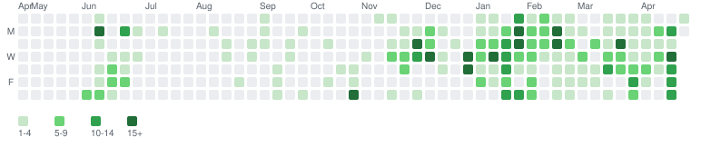

### Hi there 👋

Here are a few of the langauges I have worked with on github! Additionally, most of my work is on self-hosted git platforms.

Also, I'm typically not on github unless I'm working on a team that uses it. Checkout my gitlab activity also!

 

<!--

**sjacobflaherty/sjacobflaherty** is a ✨ _special_ ✨ repository because its `README.md` (this file) appears on your GitHub profile.

Here are some ideas to get you started:

- 🔭 I’m currently working on ...
- 🌱 I’m currently learning ...
- 👯 I’m looking to collaborate on ...
- 🤔 I’m looking for help with ...
- 💬 Ask me about ...
- 📫 How to reach me: ...
- 😄 Pronouns: ...
- ⚡ Fun fact: ...
-->
